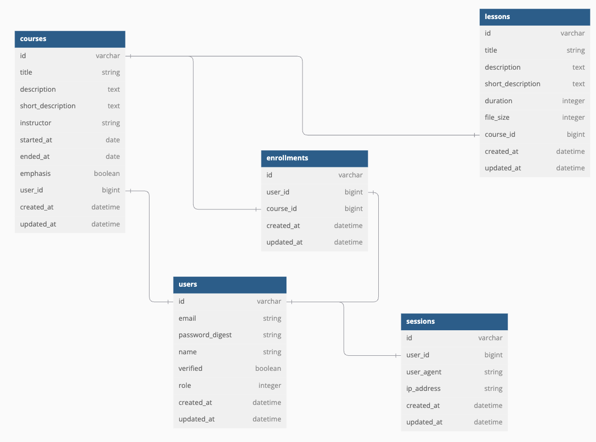

# LMS (Learning Management System)

## 📝 Sobre o Projeto
Este é um Sistema de Gestão de Aprendizagem (LMS) desenvolvido em Ruby on Rails, projetado para fornecer uma plataforma educacional robusta e intuitiva. O sistema permite a gestão de cursos.

## 🚀 Tecnologias Utilizadas
- Ruby on Rails
- PostgreSQL
- Docker & Docker Compose
- TailwindCSS
- Minitest para testes

## 🏗️ Arquitetura do Projeto
O projeto segue a arquitetura MVC (Model-View-Controller) do Rails e utiliza containers Docker para garantir um ambiente de desenvolvimento consistente.

### Estrutura do Banco de Dados


## ⚙️ Requisitos
- Docker
- Docker Compose
- Git

## 🛠️ Configuração do Ambiente

### 1. Clonando o Repositório
```bash
git clone https://github.com/frankyston/test_twygo_lms
cd test_twygo_lms
```

### 2. Configuração das Variáveis de Ambiente
- Crie os arquivos `.env` e `.env.test` baseados no arquivo `env.sample`
- Ajuste as variáveis de acordo com seu ambiente

### 3. Configuração da Rede Docker
```bash
docker network create -d bridge test_twygo_lms_network
```

### 4. Construção e Inicialização
```bash
# Construir a imagem
docker compose up -d --no-deps --build app

# Iniciar os containers
docker compose up -d
# ou
./scripts/up.sh
```

### 5. Configuração do Banco de Dados
```bash
# Acessar o container
docker compose run --rm app bash

# Criar o banco de dados
rails db:create

# Executar as migrações
rails db:migrate

# Popular o banco de dados
rails db:seed
```

## 🧪 Testes
Para executar os testes:
```bash
# Configurar ambiente de teste
ENV_FILE=.env.test dcr -it --rm app bash

# Executar os testes
rake test
```

## 🚀 Usando
Existe dois usuários criados no seed
- student@student.com (sem a permissão de criar curso)
- admin@admin.com (com permissão de criar curso)

Todos os dois tem a senha `123456`.

Para testar online, acesse a url: https://testetwygo.frankyston.dev

## 📧 Contato
- Nome do Desenvolvedor - [frankyston@gmail.com]
- Link do Projeto: [https://github.com/frankyston/test_twygo_lms]
